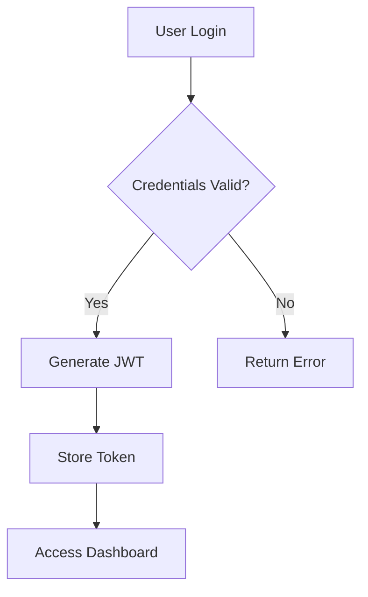

# OneCare Healthcare Platform - Technical Flow Schema

## System Architecture Overview

### High-Level System Components
```
[Frontend Web Interface] ↔ [Main Express Server] ↔ [FHIR API Server]
                         ↗                      ↗
            [WebSocket Server] ← [AI Analytics Module]
                         ↓
              [Real-time Dashboard]
```

## 1. USER AUTHENTICATION FLOW

### Sequence Diagram Format:
```
User → Frontend → Main Server → JWT Service → Database → Main Server → Frontend → User

Step 1: User enters credentials on login page
Step 2: Frontend sends POST request to /api/auth/login
Step 3: Main Server validates credentials against user database
Step 4: Server generates JWT token using jsonwebtoken library
Step 5: JWT token returned to frontend
Step 6: Frontend stores token in localStorage
Step 7: Token included in Authorization header for all subsequent requests
```

### Decision Points:
- Valid Credentials? → Generate JWT → Success
- Invalid Credentials? → Return 401 Error → Redirect to Login

## 2. PATIENT DASHBOARD DATA FLOW

### Main Data Pipeline:
```
Frontend Request → JWT Validation → Role Check → API Route → Data Processing → Database Query → Response Formation → Frontend Rendering

Detailed Steps:
1. Patient logs in and navigates to dashboard
2. Frontend makes GET request to /api/patient/dashboard
3. Main server validates JWT token
4. Server checks user role (Patient)
5. Server queries multiple data sources:
   - Patient demographics
   - Recent appointments
   - Health records
   - Notifications
6. Data aggregated and formatted
7. JSON response sent to frontend
8. Frontend renders dashboard components
```

## 3. REAL-TIME MESSAGING SYSTEM FLOW

### WebSocket Communication Pipeline:
```
User A → Frontend → WebSocket Server → Message Queue → WebSocket Server → Frontend → User B

Technical Sequence:
1. User A opens messages page
2. Frontend establishes WebSocket connection to port 3002
3. User A types message and clicks send
4. Frontend emits 'sendMessage' event via Socket.IO
5. WebSocket server receives message
6. Server validates sender authentication
7. Server determines recipient(s)
8. Message stored in memory/database
9. Server emits 'newMessage' event to recipient's socket
10. Recipient's frontend receives event
11. Message displayed in real-time on recipient's screen
```

### Connection Management:
- Connection Established → User Added to Active Users
- Message Sent → Validate → Route → Deliver
- Connection Lost → User Removed from Active Users

## 4. AI HEALTH ANALYTICS PROCESSING FLOW

### Data Analysis Pipeline:
```
Patient Data Input → Data Validation → AI Processing → Risk Assessment → Recommendation Generation → Result Storage → Provider Notification

Detailed Process:
1. Patient data collected (vitals, symptoms, history)
2. Data validated and sanitized
3. AI analytics module (ai-health-analytics.js) processes data
4. Risk scoring algorithms applied
5. Comparative analysis with historical data
6. Health recommendations generated
7. Results stored in database
8. Provider notified via WebSocket if high risk detected
```

### AI Decision Tree:
- Normal Range → Low Risk → Routine Monitoring
- Borderline Values → Medium Risk → Increased Monitoring
- Critical Values → High Risk → Immediate Provider Alert

## 5. FHIR API INTEGRATION FLOW

### FHIR Resource Management:
```
External System → FHIR API Server → Resource Validation → Data Transformation → Internal Database → Response Generation → External System

FHIR Operations Flow:
1. External EHR system requests patient data
2. Request hits FHIR API server (port 3003)
3. JWT token validated
4. FHIR resource type identified (Patient, Observation, etc.)
5. Data retrieved from internal storage
6. Data transformed to FHIR R4 format
7. FHIR-compliant JSON response returned
8. External system processes standard FHIR data
```

### Supported FHIR Resources:
- Patient → Demographics, identifiers
- Observation → Lab results, vital signs
- Condition → Diagnoses, problems
- Medication → Prescriptions, medications

## 6. SYSTEM MONITORING & ADMIN FLOW

### Real-time Monitoring Pipeline:
```
System Metrics Collection → Data Processing → WebSocket Broadcast → Admin Dashboard → Alert Generation

Monitoring Sequence:
1. System continuously collects metrics (CPU, memory, response times)
2. Metrics processed and formatted
3. Data broadcast via WebSocket to admin dashboard
4. Charts updated in real-time using Chart.js
5. Threshold breaches trigger alerts
6. Admin notified via multiple channels
```

## 7. APPOINTMENT SCHEDULING FLOW

### Booking Process:
```
Patient Request → Availability Check → Provider Calendar → Slot Reservation → Confirmation → Notification Pipeline

Detailed Steps:
1. Patient selects appointment type and preferred time
2. System checks provider availability
3. Calendar integration validates time slot
4. Appointment created in database
5. Confirmation sent to patient
6. Provider notified via WebSocket
7. Calendar events created for both parties
8. Reminder system activated
```

## 8. ERROR HANDLING & LOGGING FLOW

### Error Processing Pipeline:
```
Error Occurrence → Error Classification → Logging → User Notification → Admin Alert → Resolution Tracking

Error Handling Sequence:
1. Error occurs in any system component
2. Error caught by appropriate middleware
3. Error classified by severity (INFO, WARN, ERROR, CRITICAL)
4. Winston logger records error details
5. User-friendly error message generated
6. Admin dashboard updated with error metrics
7. Critical errors trigger immediate notifications
```

## 9. DATABASE OPERATIONS FLOW

### Data Persistence Pipeline:
```
API Request → Data Validation → Transaction Start → Database Operation → Result Validation → Transaction Commit → Response

Database Interaction:
1. API endpoint receives data request
2. Input validation using Joi schemas
3. Database transaction initiated
4. CRUD operations performed
5. Data integrity checks
6. Transaction committed or rolled back
7. Success/failure response sent
```

## 10. MULTI-SERVER ORCHESTRATION

### Server Startup Sequence:
```
start-servers.js → Environment Check → Server Initialization → Health Checks → Service Registration → Ready State

Startup Process:
1. Execute npm run start:all
2. start-servers.js reads configuration
3. Main Express server starts (port 3000)
4. WebSocket server starts (port 3002)
5. FHIR API server starts (port 3003)
6. Health checks performed on all services
7. Inter-service communication established
8. System ready for user requests
```

---

## FLOWCHART CREATION GUIDE

### For Lucidchart/Draw.io:
1. Create separate swimlanes for: Frontend, Main Server, WebSocket Server, FHIR Server, Database
2. Use rectangles for processes, diamonds for decisions, circles for start/end
3. Color-code by server: Blue (Frontend), Green (Main Server), Orange (WebSocket), Purple (FHIR)

### For Mermaid Syntax:


### Key Decision Points to Highlight:
- Authentication checks
- Role-based access control
- Data validation gates
- Error handling branches
- Real-time vs batch processing choices

### Critical Paths to Emphasize:
1. User authentication and authorization
2. Real-time message delivery
3. AI health risk assessment
4. FHIR data exchange
5. System monitoring and alerting

This document provides multiple levels of detail that you can adapt based on your flowchart tool's capabilities and your presentation needs.